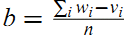

## L5 Action2
**Slope One Predictors for Online Rating-Based Collaborative Filtering论文笔记**

*Abstract* 

作者提出了三种Slopeone模型。
主要思路是从同时对两个物品都评分过的人那里获取两个物品评分的差值。

*Introduction*

目的是提出一个有以下特点的算法模型：简单实用高效，随时更新，查询快捷，对新用户依赖不高，对其他物品打分不多的人也能收到较好的推荐效果。
确定一个物品比另一个物品的受欢迎程度高多少。与基于内存的协同过滤相比有着相同的准确率，且更经得起检验。

*Related Work*

基于内存的协同过滤有一些缺点：扩展性不好，在数据稀疏时过于敏感。不能预先计算好以供快速在线查询。对user，item数据量的最小值有要求。一个比较著名的基于内存的模型：Pearson scheme.

基于模型的算法如基于线性代数的（SVD，PCA，特征分解），人工智能的算法（贝叶斯，隐分类，神经网络）等等，查询调用更快。

基本形式 f(x)=x+b，b是常数，f就是从一个物品的评分来预测另一个物品评分的函数。其他论文中的方法有f(x)=x,f(x)=ax+b,二次方函数等。但是并没有比基于内存的方法提升多少。

*CF Algorithms*

我们提出三种新协同过滤模型（Slope one,Weighted slope one,Bi-polar slope one），对比四种参照模型：每个用户的均值，均值的偏差，调整的物品余弦相似度，Pearson scheme

Slope one模型考虑的信息，既包括其他用户对相同物品的评分，也包括该用户对其他物品的评分。基本思想是。  
先定义两个物品的偏差，所有同时对物品i物品j都打过分的人，计算对两个物品打分差，然后求和，再除以总人数。  
一个人我们要预测他对物品j的打分，他之前对若干个物品都有打分，我们分别求这若干个物品对于j的偏差（不包括该用户的评分），然后用该用户对这若干个物品的打分加上对应偏差再求和再除以这些物品个数，那就是预测出该用户对物品j的打分。等同于该用户对之前所有物品评分的均值加上其他用户对于这些物品和j的偏差的均值。

加权的Slope one模型。简单Slope one的一个缺点是评分的数量没有考虑。J和L的偏差是基于2000个样本计算出的，K和L的偏差是基于20个样本算出的，显然J对L的偏差更有说服力。加权Slope one引入评分的个数作为权重。

两极slope one模型。把用户对物品的评分分为两种，喜欢和不喜欢。一个人他对他所有物品的打分的平均值作为他喜欢或不喜欢一个物品的分水岭。用物品i来预测用户对物品j的评分，如果此用户喜欢物品i那么找出所有同时喜欢物品j和i的所有人，用他们对i和j的偏差均值加上此用户对物品i的评分再乘以权重同时喜欢i和j的总人数，此用户不喜欢物品k,用找出所有同时不喜欢k和j的人，用他们对k,j的偏差均值加上此用户对k的评分再乘以同时不喜欢j,k的总人数，将这些求和后除以这些总人数的求和。

*Experimental Result*

用EachMovie 和 Movielens数据集进行测试，对于EachMovie数据集，Pearson和Bi-polar slope one的表现最好。对于Movielens数据集，三种slope-one算法表现同样好，并且优于所有其他算法。结论：Slope one及衍生出的Weighted Slope one和Bi-polar Slope one模型是性价比极高的评分预测方法。

