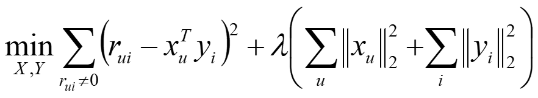
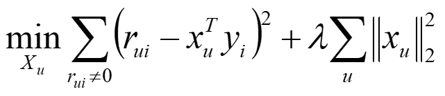
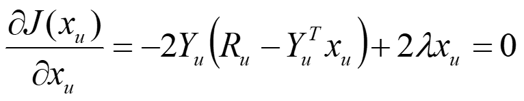
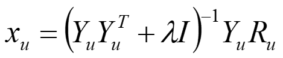
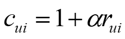
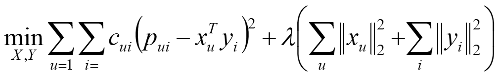
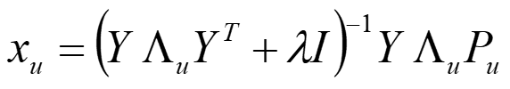
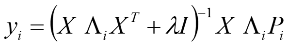

## L5 Thinking

**2. 矩阵分解算法ALS-WR是如何进行的？**
进行矩阵分解算法的时候首先要确定损失函数                          

Rui是已知评分矩阵中真实得分，X，Y都是未知的，加入正则项避免过拟合，可以用ALS交替最小二乘法最小化损失函数                             
先固定Y优化X（Y取随机值或者全局平均值）

对Xu求梯度且梯度为0

求解得

更新得到的X用同样的方法求解Y，然后更新Y再次求解X，重复上述步骤直到结果收敛或是达到限定的最大迭代次数   

如果我们有隐式反馈信息rui，比如浏览次数，停留时间等，我们可以引入置信度作为权重  
目标损失函数变为   用同样的ALS方法求解得
Λu 为用户u 对所有物品的置信度cui 构成的对角阵
同样求解y 
Λi 为所有用户对物品i 的偏好的置信度构成的对角矩阵。

更新X，更新Y重复上述步骤直到收敛或达到最大迭代次数。这就是ALS-WR矩阵分解算法

**5.你阅读过和推荐系统，机器学习相关的论文么？有哪些论文是你比较推荐的，可以分享到微信群中**

之前没有阅读过相关论文，这次阅读了Slope One Predictors for Online Rating-Based Collaborative Filtering这篇论文。Slope one基本原理非常简单，应用起来也比较方便，效果也比较好，印证了奥卡姆剃刀原理。对比传统的bias from mean, adjusted cosine item-based, per user average, pearson这些算法，Slope one系列性价比非常高。作者在一个简单idea的基础上，不断完善，提出了weighted Slope one模型，然后作者又有了创新想法，区分喜欢和不喜欢，进一步提出了Bi-polar Slope one模型，提升了预测效果。我们平时思考问题时，可以先提出一个简单的解决办法，然后进一步考虑多种情况来完善它，如果有一些创新的idea可以加入，通过测试来验证。

